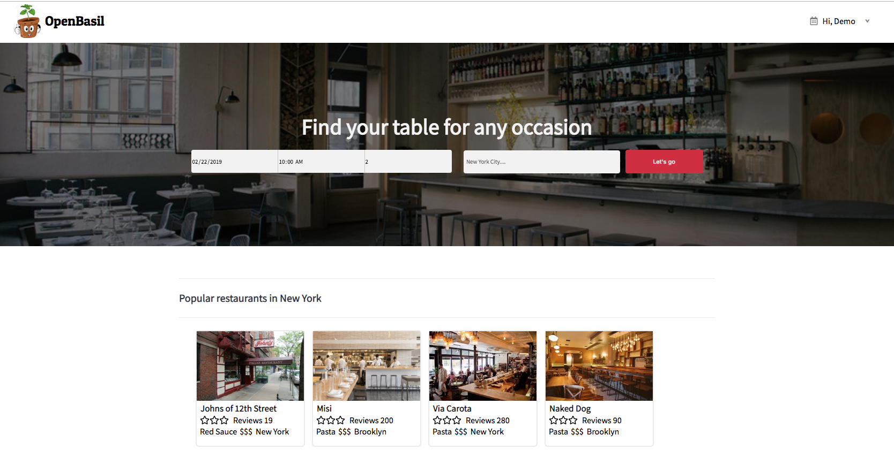
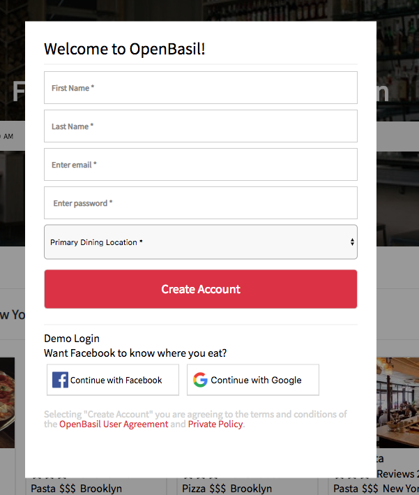
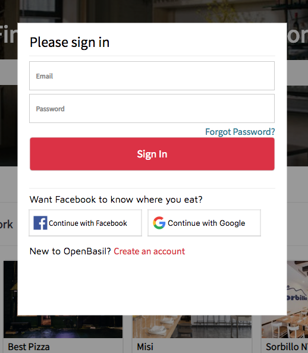
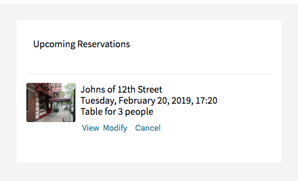

# README

# OpenBasil

[OpenBasil live](https://openbasil.herokuapp.com/#/)


OpenBasil is a clone of OpenTable. Which allows users to browse restaurants and book reservations. A user can scroll through restuarants available and book a reservation. Read or leave reviews. If a user can't make their reservation, they have the ability to cancel it.




## Feature Highlights

### Login/Logout Modals
When a user clicks sign up/sign in the components are rendered as modals. A user can fill in form and submit or click outside the modal to close.



>  Sign Up modal pops out


> Sign In modal pops out


``` javascript
function Modal({modal, closeModal}){
  if (!modal){
    return null;
  }
  let component;
  switch (modal) {
    case 'login':
      component =<LoginFormContainer/>;
      break;
    case 'signup':
      component = <SignupFormContainer/>;
      break;
    default:
      return null;
  }

  return(
    <div className="modal-background" onClick={closeModal}>
      <div className='modal-child' onClick={ e => e.stopPropagation()}>
        {component}
      </div>
    </div>
  );

}

const mapStateToProps = state =>{
  return{
    modal: state.ui.modal
  };
};

const mapDispatchToProps = dispatch => {
  return {
    closeModal: () => dispatch(closeModal())
   }
}
```

### Reservations
Part of OpenBasil's appeal and primary purpose is the ability to book reservations at restaurants. Only logged in usercan book reservations. Users can view their reservations in the index page. Users can delete reservations


> Users can view all their reservations


## Technologies Used
+ Ruby on Rails
+ PostgreSQL
+ JavaScript (ES6)
+ React.js and Redux
+ HTML and CSS

## Future Implementations
WIP features inlude:
+ Search bar
+ Updating reservations
+ User profile
+ styling restaurant page